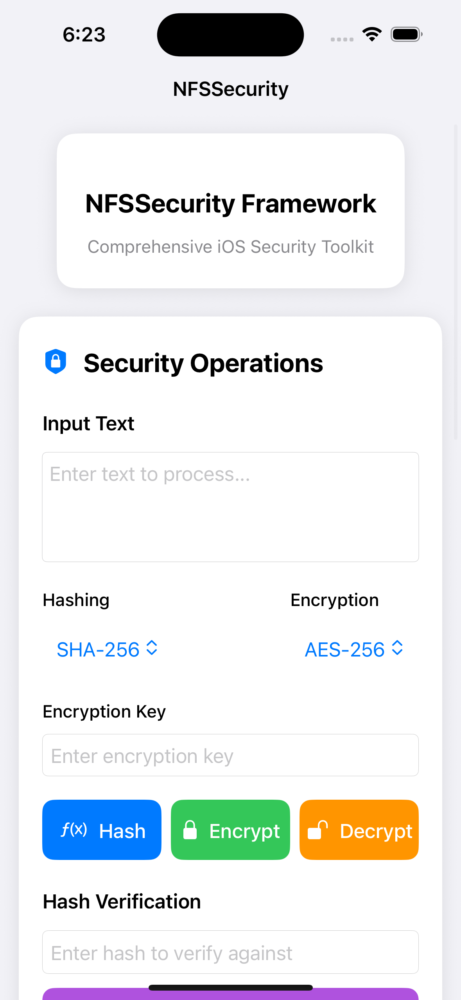

# NFSSecurity

[](https://swift.org)
[](#requirements)
[](https://swift.org/package-manager/)
[](LICENSE)

---

## 🚨 Overview

**NFSSecurity** is a modern, modular, and production-ready Swift framework for iOS and macOS, providing a comprehensive suite of security tools for app developers. It covers encryption, hashing, biometrics, keychain, integrity, jailbreak/debugger/simulator detection, network security, random generation, screen shielding, and more—all with a clean, extensible API and a beautiful SwiftUI example app.

- **Swift-first**: Built for Swift 6, fully concurrency-safe, and designed for modern app architectures.
- **Modular**: Use only what you need. Each feature is a separate, testable component.
- **Extensible**: Easily customize or extend any part of the framework.
- **Battle-tested**: Follows best practices and leverages Apple's CryptoKit, LocalAuthentication, and Security frameworks.

---

## ✨ Features

- **Encryption**: AES-128, AES-256, ChaCha20 (with IV/nonce support)
- **Hashing**: MD5, SHA-1, SHA-256, SHA-512, HMAC-SHA256, HMAC-SHA512
- **Biometric Authentication**: Face ID, Touch ID, fallback to device passcode
- **Keychain Management**: Securely store, retrieve, update, and delete sensitive data
- **Jailbreak, Debugger, Simulator, Reverse Engineering Detection**
- **App Integrity Checks**: Code signing, bundle, entitlements, file hashes, tampering
- **Network Security**: Proxy/VPN detection, certificate pinning, SSL validation, reachability
- **Random Data Generation**: Secure random strings, passwords, UUIDs, tokens
- **Screen Shield**: Prevent screenshots, screen recording, AirPlay, blur on background
- **Swift Concurrency**: Async/await support for all major operations
- **Production-Ready**: Modular, extensible, and concurrency-safe
- **Beautiful SwiftUI Example App**: Modern, user-friendly, and interactive

---

## 🏗️ Architecture

NFSSecurity is organized into modular managers, each responsible for a specific security domain. The main `NFSSecurity` singleton composes these managers and exposes a unified API.

```
NFSSecurity
├── BiometricManager
├── KeychainManager
├── EncryptionManager
├── HashingManager
├── IntegrityManager
├── JailbreakDetection
├── DebuggerDetection
├── NetworkSecurityManager
├── RandomGenerator
├── ScreenShield
├── ModesChecker
└── ... (extensible)
```

All managers are configurable via `NFSSecurityConfiguration`, allowing you to enable/disable features, set algorithms, customize keys/IVs, and more.

---

## 📱 Requirements

- **Swift**: 6.0+
- **iOS**: 13.0+
- **macOS**: 10.15+
- **Dependencies**: None (uses Apple frameworks: CryptoKit, LocalAuthentication, Security)

---

## 📦 Installation

### Swift Package Manager (Recommended)

1. In Xcode, go to **File > Add Packages...**
2. Enter the repository URL:
   ```
   https://github.com/programmer443/NFSSecurity.git
   ```
3. Select the `NFSSecurity` package and add it to your target.

---

## ⚡ Quick Start

```swift
import NFSSecurity

let security = NFSSecurity.shared

// Hashing
let hash = try security.hash("Hello, world!", using: .sha256)

// Encryption
let encrypted = try security.encrypt("Sensitive Data".data(using: .utf8)!, using: .aes256, withKey: "mysecretkey1234567890")
let decrypted = try security.decrypt(encrypted, using: .aes256, withKey: "mysecretkey1234567890")

// Biometric Auth
if security.isBiometricAvailable() {
    let authenticated = try await security.authenticateWithBiometrics(reason: "Access secure area")
}

// Keychain
try security.storeStringInKeychain("mySecret", forKey: "token")
let token = try security.retrieveStringFromKeychain(forKey: "token")

// Integrity & Network
let integrity = security.performIntegrityCheck()
let network = security.checkNetworkSecurity()
```

---

## 🛠️ Comprehensive Usage

### Hashing
```swift
let hash = try security.hash("data to hash", using: .sha512)
let isValid = try security.verifyHash("data to hash".data(using: .utf8)!, hash: hash, using: .sha512)
```

### Encryption/Decryption
```swift
let encrypted = try security.encrypt("Secret".data(using: .utf8)!, using: .aes128, withKey: "key1234567890123")
let decrypted = try security.decrypt(encrypted, using: .aes128, withKey: "key1234567890123")
```

### Biometric Authentication
```swift
if security.isBiometricAvailable() {
    let authenticated = try await security.authenticateWithBiometrics(reason: "Authenticate to proceed")
}
```

### Keychain Management
```swift
try security.storeStringInKeychain("value", forKey: "key")
let value = try security.retrieveStringFromKeychain(forKey: "key")
try security.deleteFromKeychain(forKey: "key")
```

### Random Generation
```swift
let randomString = try security.generateRandomString(length: 32)
let password = try security.generateSecurePassword(length: 20)
let uuid = security.generateUUID()
```

### Screen Shield
```swift
@MainActor
security.enableScreenShield()
// ...
security.disableScreenShield()
```

### Network Security
```swift
let result = security.checkNetworkSecurity()
if !result.isSecure {
    print(result.issues)
}
```

### Integrity Checks
```swift
let result = security.performIntegrityCheck()
if !result.isValid {
    print(result.issues)
}
```

---

## 🔧 Advanced Usage & Customization

### Custom Configuration

You can customize every aspect of NFSSecurity via `NFSSecurityConfiguration`:

```swift
let config = NFSSecurityConfiguration(
    encryption: .init(defaultAlgorithm: .aes256, keySize: 32, salt: "mysalt"),
    hashing: .init(defaultAlgorithm: .sha512, salt: "mysalt"),
    screenShield: .init(enabled: true, preventScreenshots: true, blurOnBackground: true),
    enableLogging: true,
    enableErrorReporting: true,
    customErrorHandler: { error in
        print("Security error: \(error)")
    }
)
// Pass config to your custom managers if needed
```

### Extending & Integrating
- Implement your own managers by conforming to the relevant protocols (e.g., `EncryptionManagerProtocol`, `HashingManagerProtocol`).
- Swap out or extend any component for custom logic.
- Use the provided SwiftUI `SecureView` and `BlurredBackgroundView` for UI protection.

---

## 🖥️ Example App (SwiftUI)

The included example app demonstrates all features with a modern, user-friendly interface:

- **Hashing & Encryption**: Select algorithms, enter data, copy results
- **Biometric Auth**: Test Face ID/Touch ID
- **Keychain**: Store/retrieve values
- **Random Generation**: Secure strings, passwords, UUIDs
- **Security Checks**: Jailbreak, debugger, proxy, integrity, network
- **Copy Buttons**: Easily copy any result

## 📸 Screenshots

---

## 🔒 Security Best Practices
- Always use strong, unique keys for encryption
- Never hardcode secrets in your app
- Use biometric authentication for sensitive actions
- Regularly check for jailbreak/debugger/simulator
- Use certificate pinning for network requests
- Keep your dependencies up to date

---

## 🤝 Contributing

Contributions, bug reports, and feature requests are welcome!

1. Fork the repo
2. Create your feature branch (`git checkout -b feature/YourFeature`)
3. Commit your changes (`git commit -am 'Add new feature'`)
4. Push to the branch (`git push origin feature/YourFeature`)
5. Open a Pull Request

---

## 📄 License

NFSSecurity is released under the MIT License. See [LICENSE](LICENSE) for details.

---

## 🙏 Acknowledgements
- [Apple CryptoKit](https://developer.apple.com/documentation/cryptokit)
- [Swift Crypto](https://github.com/apple/swift-crypto)
- [LocalAuthentication](https://developer.apple.com/documentation/localauthentication)
- [CommonCrypto](https://developer.apple.com/documentation/security/1399291-commoncrypto)

---

## 💬 Support
For questions, issues, or support, please open an issue on GitHub or contact the maintainer. 
